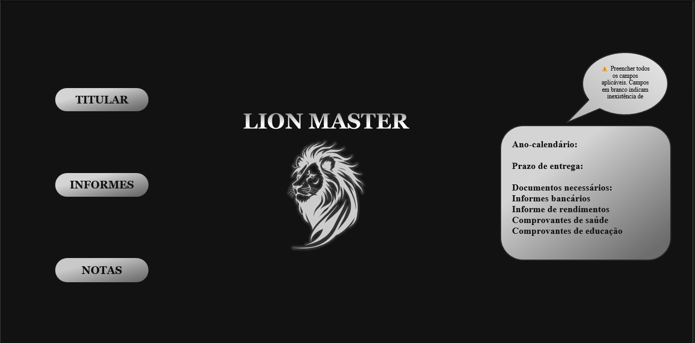

# 🦁 Lion Master - Gestão e Organização Fiscal

O **Lion Master** é uma solução em Excel desenvolvida para simplificar a coleta e organização de documentos e dados financeiros, ideal para preparação de declarações de imposto de renda.

## 📋 Funcionalidades
* **Módulo Titular:** Cadastro completo de dados pessoais e dependentes.
* **Controle de Informes:** Centralização de rendimentos bancários com espaço para anexos.
* **Registro de Entradas:** Tabela dinâmica para notas bancárias e extratos de holerite.
* **Interface Intuitiva:** Menu lateral interativo com navegação fluida entre seções.

## 🖼️ Demonstração Visual

## 🛠️ Diferenciais Técnicos
* Design moderno com modo escuro (Dark Mode).
* Navegação via hiperlinks e botões personalizados.
* Estruturação de dados otimizada para conferência rápida.

## 💡 Como utilizar
Basta baixar o arquivo disponível neste repositório e navegar pelas abas utilizando o menu lateral esquerdo.
